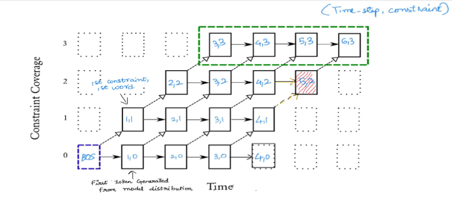
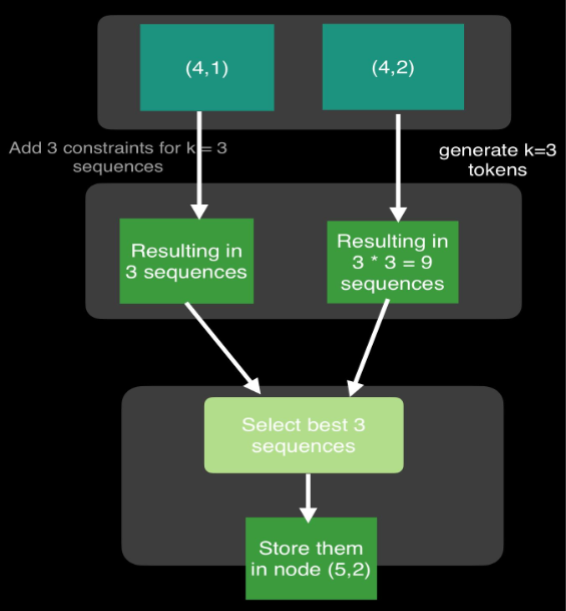

# 🌟 Lexically Constrained Beam Search  

## 📖 Overview  
This project explores **lexically constrained beam search**, inspired by the algorithm presented in **Hokamp and Liu’s paper**. The goal is to enhance machine translation by incorporating **contextually relevant constraints** to guide the translation process. This method ensures that specific words or phrases appear in the output while keeping the model parameters unchanged.  

- **Language Pair**: Turkish → English  
- **Dataset**: WMT (Turkish-English)  
- **Model**: [MarianMT](https://huggingface.co/docs/transformers/model_doc/marian)  

---

## 🧠 Algorithm  
Beam search improves text generation by pursuing the top **k probabilities** instead of choosing the highest probability word at each step. This project incorporates **content-relevant constraints** to generate contextually relevant translations.  

### How It Works:  
1. **Dynamic Programming**: Nodes represent sequence length (x-axis) and constraints covered (y-axis).  
2. **Constraint Coverage**: Constraints can be generated (dashed lines) or model-predicted (horizontal lines).  
3. **Beam Search**: At each node, the top-k beams are retained by evaluating all possible sequences.

- **Beam Size (k)**: 4  
- **Max Sequence Length**: 23  

---

  
**Fig. 1**: Visualization of decoding (adapted from [Hokamp and Liu](https://aclanthology.org/P17-1141.pdf)).  

---

### Example:  
To calculate top-k beams for a node `(5,2)`:  
- Add constraints from `(4,1)` (vertical dashed line) → k beams.  
- Generate sequences from `(4,2)` → k × k beams.  
- Retain the top-k sequences for `(5,2)`.

  
**Fig. 2**: Beam search process explained.  

---

## ⚙️ Implementation  

### 🔧 Steps:  
1. **Constraint Extraction**:  
   - Constraints are identified from the training data based on co-occurrence probabilities.  
   - Normalized Pointwise Mutual Information (NPMI) > 0.9 is used to select high-relevance bigrams.  

2. **Beam Search Algorithm**:  
   - Dynamic programming approach based on Hokamp and Liu’s algorithm.  
   - Validated using ~1000 translations with constrained and unconstrained output.

### 💡 Constraint Extraction Details:  
- Extracted from **bigrams** in 207,000 translation pairs.  
- Constraints: **570 pairs** with NPMI > 0.9.  
- Lower NPMI thresholds yielded more constraints but reduced quality.  

---

## 📊 Evaluation  

### 🔍 Metrics:  
- **BLEU Score**: Measures n-gram overlap between predicted and target translations.  
  - **With Constraints**: 22.82  
  - **Without Constraints**: 35.93  

| **Metric**  | **With Constraints** | **Without Constraints** |  
|-------------|-----------------------|--------------------------|  
| BLEU        | 22.82                | 35.93                   |  
| ROUGE-1     | 0.4788               | 0.6108                  |  
| ROUGE-2     | 0.2732               | 0.4387                  |  
| ROUGE-L     | 0.4054               | 0.5602                  |  

---

### ✏️ Observations:  
- BLEU and ROUGE scores were lower with constraints, suggesting they reduced fluency in some translations.  
- Constraints improved relevance but occasionally forced unnatural phrasing.  
- **Sanity Tests** confirmed the presence of constraints in output translations.  

---

## 📝 Summary  
- **Dataset Limitations**: The WMT dataset’s lack of domain specificity hindered the generation of impactful constraints.  
- **Key Finding**: Domain-specific datasets (e.g., Autodesk post-editing corpus) could significantly improve constraint quality.  
- **Outcome**: Successfully implemented constrained beam search, demonstrating its potential for translation tasks with proper datasets.  

---

## 📚 References  
1. [Marian MT model](https://huggingface.co/docs/transformers/model_doc/marian)  
2. [Code to get the logits](https://huggingface.co/docs/transformers/main_classes/output)  
3. [BOS and EOS tokens](https://huggingface.co/docs/transformers/main_classes/configuration#transformers.PretrainedConfig.decoder_start_token_id)  
4. [Torch top-k values](https://pytorch.org/docs/stable/generated/torch.topk.html)  
5. [Hokamp and Liu Paper](https://arxiv.org/pdf/1704.07138)  
6. [BLEU score evaluation](https://www.nltk.org/api/nltk.translate.bleu_score.html)  
7. [ROUGE score evaluation](https://huggingface.co/spaces/evaluate-metric/rouge/blob/main/README.md)  
